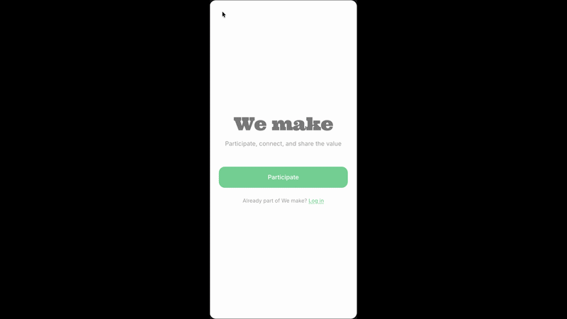
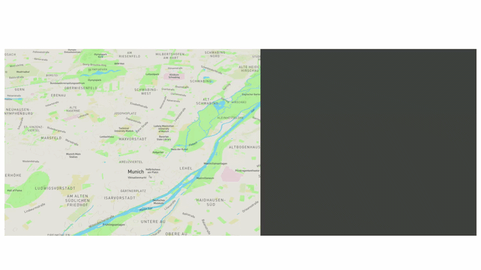

# 🚀 PolisenseAI X SAVING PUBLIC DISCOURSE HACK

# Inclusion Priority Index (IPI)
### A Multi-Theoretical Civic Participation Prioritization Framework

**WeMakeByPolisenseAI App Solution**  

#### Demo

  

---

## 📋 Table of Contents
- [1. Overview](#1-overview)
- [2. Intellectual Inspirations](#2-intellectual-inspirations)
- [3. Core Equation](#3-core-equation)
- [4. Component Design Logic](#4-component-design-logic)
- [5. Conceptual Structure](#5-conceptual-structure-of-the-model)
- [6. Intended System Effects](#6-intended-system-effects)
- [7. Limitations and Ethical Considerations](#7-limitations-and-ethical-considerations)
- [8. Summary](#8-summary)

---

## 1. Overview

The **Inclusion Priority Index (IPI)** is a computational model designed to prioritize citizen participation in civic and policy discourse.  

It emerges from a **hybrid synthesis** of deliberative democracy, theories of justice, agonistic pluralism, and modern algorithmic fairness.  

Its goal is to create a **dynamically fair public sphere** by intelligently balancing:
- Policy relevance
- Structural inequality
- Representation imbalance
- Participation fatigue

Instead of treating participation as uniform access, the IPI regards it as a **contested, unequal, and dynamically distributed resource** that demands continuous correction.

---

## 2. Intellectual Inspirations

The model draws wisdom from multiple traditions, each shaping a core design principle.

### 2.1 Deliberative Democracy (Jürgen Habermas, John Dryzek)

> *“Legitimacy emerges through inclusive and reasoned participation in the public sphere.”*

**Contributions:**
- Strong emphasis on including affected stakeholders
- Prioritizing communicative legitimacy over simple aggregation
- Focus on overall discourse quality

The IPI extends this by addressing real-world constraints like access, fatigue, and bias.

### 2.2 Agonistic Pluralism (Chantal Mouffe)

> *“Democratic spaces are inherently conflictual rather than consensus-driven.”*

**Contributions:**
- Recognition that exclusion is often politically structured
- Bringing marginalized voices and antagonisms into visibility
- Accepting disagreement as a permanent, productive feature

This directly powers the **Representation Gap** mechanism.

### 2.3 Justice Theory (John Rawls, Iris Marion Young)

**Key influences:**
- Rawls: Fairness under structural inequality
- Young: Difference, group marginalization, and communicative asymmetry

**Contributions:**
- Redistributing participation opportunities toward underrepresented groups
- Acknowledging that equal access ≠ equal voice

### 2.4 Socio-Technical Systems & Algorithmic Fairness

Integrates bias correction, weighted sampling, fatigue balancing, and multiplicative constraints from modern ML fairness literature.

This ensures the framework is not only theoretically sound but **practically implementable**.

---

## 3. Core Equation

### Participation Priority Formula

$$
P_i = \left[ (I_a \times 0.4) + (G_d \times 0.6) \right] \times A_s \times F_p
$$

**Variables:**

| Symbol | Meaning                              | Weight / Role                  |
|--------|--------------------------------------|--------------------------------|
| $P_i$  | Participation priority score for citizen *i* | Final score                   |
| $I_a$  | **Impact Alignment** (policy relevance)     | 40% in additive layer         |
| $G_d$  | **Representation Gap** (underrepresentation) | 60% in additive layer         |
| $A_s$  | **Accessibility Multiplier**                | Structural barrier correction |
| $F_p$  | **Fatigue Penalty**                         | Prevents dominance            |

---

## 4. Component Design Logic

### 4.1 Impact Alignment ($I_a$)
Measures how directly a citizen’s lived experience, profession, or identity intersects with the policy domain.  
**Goal:** Elevate epistemically relevant voices beyond pure demographics.

### 4.2 Representation Gap ($G_d$)
Quantifies deviation between census benchmarks and actual participation rates.  
**Goal:** Actively correct systemic underrepresentation.

### 4.3 Accessibility Multiplier ($A_s$)
Adjusts for barriers such as digital exclusion, language, disability, etc.  
**Goal:** Turn exclusion into prioritization signals.

### 4.4 Fatigue Penalty ($F_p$)
Reduces priority based on recent participation frequency.  
**Goal:** Encourage rotational engagement and prevent monopolization.

---

## 5. Conceptual Structure of the Model

The IPI uses a deliberate **hybrid logic**:

- **Additive layer** (`Impact + Representation`): Balances relevance with equity  
- **Multiplicative layer** (`Accessibility × Fatigue`): Applies real-world constraints

This ensures:
- Relevance cannot override structural exclusion
- Frequent participants do not dominate indefinitely
- Barriers actively reshape the priority distribution

---

## 6. Intended System Effects

When implemented well, the IPI will:
- Dramatically increase diversity in civic participation
- Reduce dominance by highly active voices
- Correct underrepresentation in real time
- Improve policy relevance of collected input
- Reveal hidden structural barriers

---

## 7. Limitations and Ethical Considerations

### 7.1 Normative Encoding Risk
Weighting systems inevitably embed assumptions about relevance and fairness.

### 7.2 Data Dependency
Relies on accurate census data, attribute classification, and participation tracking.

### 7.3 Over-Correction Dynamics
Aggressive adjustments may cause rapid oscillation between groups.

### 7.4 Transparency Requirement
The model must be:
- Fully auditable
- Explainable to all participants
- Adjustable via democratic oversight

---

## 8. Summary

The **Inclusion Priority Index (IPI)** is a **composite civic prioritization framework** that synthesizes:

- Habermasian deliberative inclusion
- Mouffe’s agonistic pluralism
- Rawlsian & Youngian corrective justice
- Modern algorithmic fairness techniques

It marks a clear shift:  
**From passive equality → dynamically corrected inclusion under real-world structural inequality.**

---

**Built with ❤️ by WeMakeByPolisenseAI**  
Let’s make public discourse more inclusive, one prioritized voice at a time.
